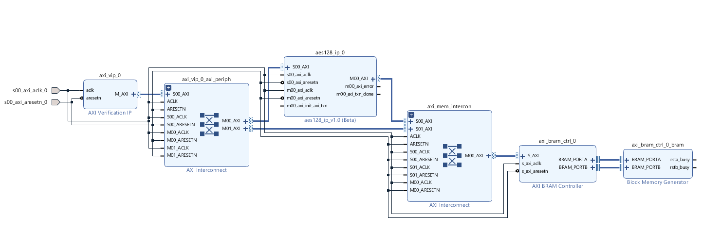
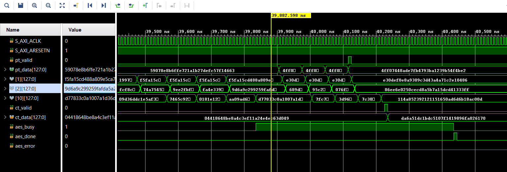
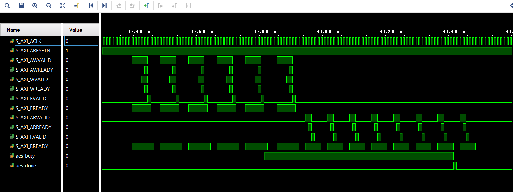

# CipherStream-128X: AXI4-Lite AES-128 Hardware Accelerator

CipherStream-128X is a fully pipelined AES-128 hardware accelerator implemented in synthesizable Verilog RTL and integrated into a SoC environment using AXI4-Lite master/slave interfaces.

The design utilizes a fully unrolled 10-stage AES pipeline capable of retiring one 128-bit ciphertext block per clock cycle after pipeline fill.

---

## Features

- Fully unrolled 10-stage AES-128 pipeline
- AXI4-Lite slave interface for configuration and control
- AXI4-Lite master interface for automated memory fetch/writeback
- One encrypted 128-bit block per clock cycle after pipeline fill
- On-the-fly key expansion architecture
- Support for ECB and CTR encryption modes
- LUT-based S-Box implementation optimized for FPGA fabrics
- Backpressure-aware AXI valid/ready handshaking
- Deterministic 10-cycle encryption latency
- Verified against FIPS-197 standard AES test vectors

---

## Architecture Overview

Unlike iterative AES implementations that reuse a single round function over multiple cycles, CipherStream-128X spatially unrolls all 10 AES rounds into independent hardware stages.

This enables:
- Simultaneous processing of multiple plaintext blocks
- High throughput for continuous data streams
- Stall-free internal datapath operation

### Major Components

- AES Encryption Core
- On-the-Fly Key Expansion Unit
- AXI4-Lite Slave Control Interface
- AXI4-Lite Master Data Interface
- Output Catching Register
- AXI Transaction FSMs

---

## Vivado Block Design

The following block design shows the integration of the CipherStream-128X accelerator within the AXI-based SoC environment.



---

## Pipeline Architecture

The accelerator implements a fully pipelined datapath:

```text
Plaintext → Stage1 → Stage2 → ... → Stage10 → Ciphertext
```

Each stage performs a dedicated AES round transformation consisting of:
- SubBytes
- ShiftRows
- MixColumns
- AddRoundKey

Once the pipeline is primed, the design achieves one ciphertext output every clock cycle.

---

## Key Expansion Strategy

The design uses an On-the-Fly Key Expansion architecture tightly coupled with the pipeline datapath.

Instead of precomputing all round keys beforehand, round keys are dynamically generated and propagated alongside their corresponding data blocks through the pipeline stages.

This approach:
- Reduces dedicated key storage requirements
- Supports dynamic key updates
- Maintains synchronization between in-flight data and keys
- Improves scalability for pipelined operation

---

## Supported Encryption Modes

### ECB (Electronic Codebook) Mode
Standard block-by-block AES encryption mode for independent plaintext blocks.

### CTR (Counter) Mode
Counter-based streaming encryption mode supporting high-throughput continuous data processing.

---

## Interface Design

### AXI4-Lite Slave Interface

Used for:
- AES key programming
- Start/stop control
- Status monitoring

Supported status signals:
- `aes_busy`
- `aes_done`
- `aes_error`

The `aes_done` signal is implemented as a single-cycle completion pulse.

### AXI4-Lite Master Interface

Used for:
- Automated plaintext fetch from memory
- Ciphertext writeback to memory

To bridge the bandwidth mismatch between the 128-bit AES datapath and 32-bit AXI4-Lite bus, the design assembles plaintext blocks over multiple AXI transactions before asserting valid pipeline input.

---

## Verification

The design was verified using a SystemVerilog-based top-level verification environment built around Xilinx AXI Verification IP (VIP).

### Verification Features

- AXI4-Lite master/slave protocol validation
- Automated plaintext/key memory transactions
- Status register polling
- AXI valid/ready handshake verification
- Timeout-based deadlock detection
- Transaction-level verification
- Randomized stress testing

### Verification Coverage

- FIPS-197 Appendix B test vectors
- FIPS-197 Appendix C test vectors
- Zero-Key / Zero-Plaintext edge cases
- Randomized pipeline stress testing
- AXI valid/ready handshake verification
- Reset synchronization verification
- Transaction-level AXI verification using Xilinx AXI VIP

### Stress Testing

A 25-iteration randomized stress test was performed using dynamically generated plaintext/key pairs.

Results:
- No pipeline stalls
- No deadlocks observed
- Stable AXI transaction behavior
- No in-flight key corruption

---

## Synthesis Results

Target FPGA:

```text
Xilinx Artix-7 (xc7a200tfbv676-2)
```

### Resource Utilization

| Resource | Utilization |
|---|---|
| Slice LUTs | 10,490 |
| Slice FFs | 3,082 |
| BRAM | 0 |

### Timing

| Metric | Value |
|---|---|
| Target Clock | 100 MHz |
| Worst Negative Slack | 1.574 ns |
| Maximum Frequency (Fmax) | 118.68 MHz |

---

## Performance

### Latency

- Fixed deterministic latency: **10 clock cycles**

### Throughput

Internal AES engine throughput:

```text
118.68 MHz × 128 bits/cycle
= 15.19 Gbps
```

Peak theoretical throughput:

```text
15.19 Gbps
```

---

## Waveforms

### AES Pipeline Propagation

Demonstrates propagation of plaintext blocks through the fully unrolled AES pipeline.



---

### AXI4-Lite Handshake Verification

Demonstrates AXI valid/ready synchronization across write and read channels.



---

## Tools Used

- Vivado Design Suite
- Verilog HDL
- SystemVerilog
- Xilinx AXI VIP

---

## Directory Structure

```text
├── src/             RTL source files
├── tb/       Verification environment
├── waveforms/       Timing and protocol waveforms
├── images/          Architecture diagrams
├── docs/            Design documentation
└── README.md
```

---

## Future Improvements

- AES-256 support
- AXI4-Full interface integration
- DMA-based burst transfers
- FPGA deployment and benchmarking
- CBC encryption mode

---

## Author

Pratyush L Daddi  
Electronics Engineering  
IIT (BHU) Varanasi
